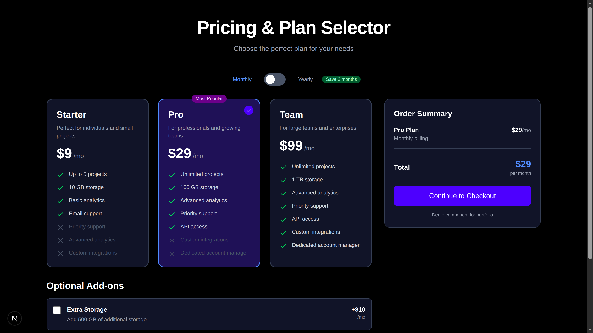
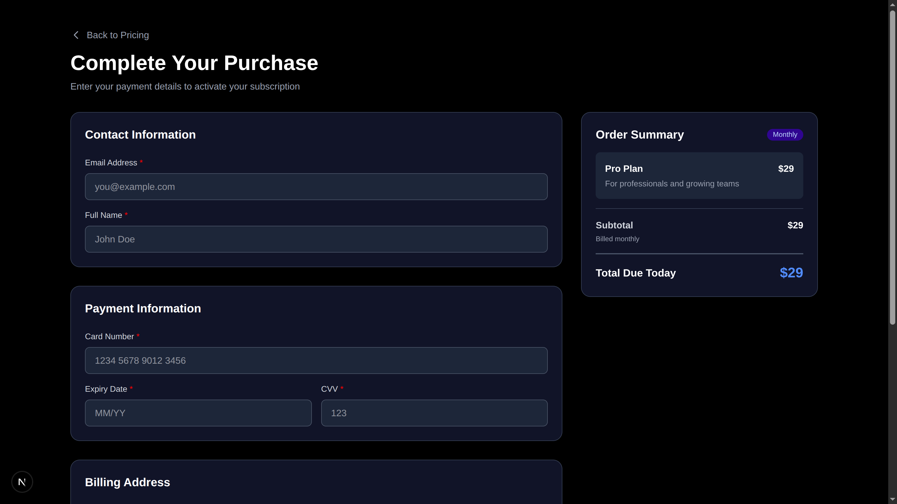

# Pricing & Plan Selector

A modern, interactive pricing page with a complete checkout flow built with Next.js 16, React 19, TypeScript, and Tailwind CSS v4. This project demonstrates complex UI state management, conditional rendering, animations, and clean component architecture.

## ✨ Features

### Pricing Page
- **Interactive Plan Toggle**: Switch between monthly and yearly billing with smooth animations
- **3 Pricing Tiers**: Starter, Pro (highlighted as most popular), and Team plans
- **Real-time Price Updates**: All prices update instantly when switching billing modes
- **Yearly Savings Display**: Shows savings calculation when yearly billing is selected
- **Feature Comparison**: Each plan displays included and excluded features with visual indicators
- **Add-ons Selection**: 3 optional add-ons (Extra Storage, Premium Support, White Label)
- **Live Summary Panel**: Real-time total calculation based on selected plan and add-ons
- **Single Plan Selection**: Only one plan can be selected at a time with visual feedback

### Checkout Page
- **Form Validation**: Complete client-side validation for all fields
- **Auto-formatting**: Card number and expiry date format automatically as you type
- **Real-time Error Handling**: Error messages appear and clear dynamically
- **Order Summary**: Displays selected plan, billing mode, add-ons, and total
- **Processing State**: Loading animation during form submission
- **Success Screen**: Confirmation page with auto-redirect
- **Navigation**: Back button to return to pricing page

### General
- **Fully Responsive**: Mobile-first design that works on all screen sizes
- **Smooth Animations**: Transitions on toggles, cards, and interactions
- **Sticky Panels**: Summary panels stick on desktop for better UX
- **TypeScript**: Full type safety with strict mode enabled
- **No Errors**: Zero console errors or TypeScript compilation errors

## Getting Started

### Prerequisites
- Node.js 18+ 
- npm, yarn, pnpm, or bun

### Installation

1. Clone the repository:
```bash
git clone https://github.com/Dev-5804/pricing-page-template.git
cd pricing-page-template
```

2. Install dependencies:
```bash
npm install
# or
yarn install
# or
pnpm install
```

3. Run the development server:
```bash
npm run dev
# or
yarn dev
# or
pnpm dev
```

4. Open [http://localhost:3000](http://localhost:3000) in your browser

### Build for Production

```bash
npm run build
npm run start
```

## Screenshots

### Pricing Page -


### Checkout Page


### Mobile View


### Success Screen


## 🛠️ Tech Stack

- **Framework**: [Next.js 16.0.3](https://nextjs.org) (App Router)
- **React**: 19.2.0
- **TypeScript**: 5.x (strict mode)
- **Styling**: [Tailwind CSS 4.x](https://tailwindcss.com)
- **Fonts**: Geist Sans & Geist Mono
- **State Management**: React hooks (`useState`)

## 📁 Project Structure

```
tricky-ui-component/
├── app/
│   ├── page.tsx              # Main pricing page
│   ├── checkout/
│   │   └── page.tsx          # Checkout form page
│   ├── layout.tsx            # Root layout
│   └── globals.css           # Global styles
├── components/
│   ├── PlanToggle.tsx        # Monthly/Yearly toggle
│   ├── PlanCard.tsx          # Individual plan card
│   ├── AddonToggle.tsx       # Add-on selection
│   ├── SummaryPanel.tsx      # Pricing summary panel
│   ├── CheckoutSummary.tsx   # Checkout order summary
│   ├── Button.tsx            # Reusable button component
│   ├── Badge.tsx             # Badge component
│   ├── Input.tsx             # Form input with validation
│   └── Label.tsx             # Form label
├── lib/
│   └── pricing-data.ts       # Pricing data & types
└── public/                   # Static assets
```

## 💡 Key Implementation Details

### State Management
- Uses React's `useState` hooks for simple, clean state management
- No external state management library needed
- State is passed via URL parameters between pages

### Form Validation
- Real-time validation with error messages
- Auto-formatting for card numbers and expiry dates
- Email validation using regex
- Required field checking

### Responsive Design
- Mobile-first approach using Tailwind breakpoints
- Grid layout adapts from single column to multi-column
- Sticky positioning for summary panels on desktop

## 🎯 Acceptance Criteria

All 21 acceptance criteria have been met:

**Pricing Page** ✅
- Monthly/Yearly toggle changes all prices
- Single plan selection at a time
- Independent add-on toggles
- Correct total calculation
- Smooth animations
- Popular badge on Pro plan
- Savings displayed for yearly
- Navigation to checkout

**Checkout Page** ✅
- Order summary displays correctly
- Form validation works
- Card auto-formatting
- Expiry date auto-formatting
- Real-time error clearing
- Processing state indicator
- Success confirmation
- Back navigation works

**General** ✅
- Fully responsive
- No errors
- Sticky panels
- Clean component structure

## 📝 License

This project is open source and available under the [MIT License](LICENSE).

## 👨‍💻 Author

**Dev-5804**
- GitHub: [@Dev-5804](https://github.com/Dev-5804)

## 🙏 Acknowledgments

- Built with [Next.js](https://nextjs.org)
- Styled with [Tailwind CSS](https://tailwindcss.com)
- Fonts by [Vercel](https://vercel.com/font)
